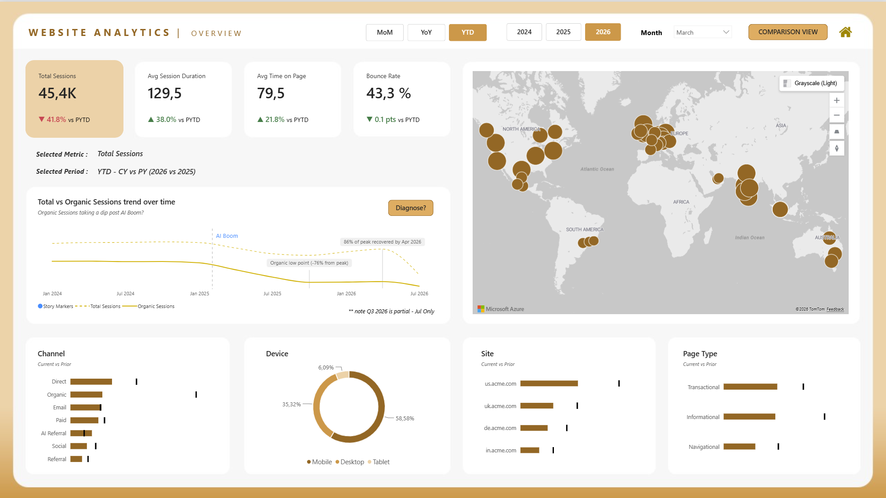
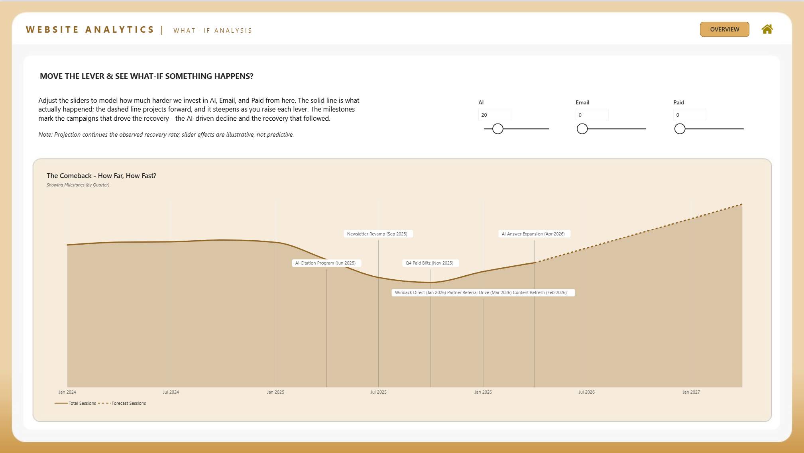

# Website Analytics: The AI Traffic Shock

**Built a full end-to-end analytics solution in Microsoft Fabric**, covering data ingestion, cleaning, dimensional modelling, a governed semantic model, an orchestrated refresh pipeline, and a three-page interactive Power BI report, all telling one coherent story about how AI search reshaped a website's traffic and what the business could do about it.


## What this is about

From early 2025, AI Overviews and assistants started answering search queries directly. People stopped clicking through to websites. For a content-heavy B2B site, that meant organic traffic dropped hard, by 76% from its peak. But the headline session number only dipped about 17%, because the team leaned into email, paid, direct, and a brand-new channel appeared: visitors arriving straight from AI tools.

That AI-referred traffic is small in volume but the best in quality. Lowest bounce rate. Highest conversion. Longest time on site. So the surface looks stable. Underneath, the whole channel mix changed completely.

**The report tells this story across three pages:**

- **Page 1:** Here is what happened. Organic sessions crashed at the AI Boom. Total sessions held because other channels compensated. The gap between the two lines is the story.
- **Page 2:** Here is who drove it. Switch between channel, device, country, site and page to see exactly which dimension members fell and which held up.
- **Page 3:** Here is what to do next. The recovery is underway. Use the sliders to model how much faster it gets there if you push harder on the channels that are working.


## Screenshots

**Home Page**


**Page 1: Overview**



**Page 2: Comparison View**


**Page 3: What-If Analysis**




## Architecture

```
Raw CSV
  -> Bronze  (Lakehouse Files, source unchanged)
  -> Silver  (cleaned table via Dataflow Gen2)
  -> Gold    (star schema: 6 dimensions + 2 fact tables)
  -> Semantic Model (Direct Lake, shared)
  -> Power BI Report (thin report, live connection)
```

**Tech:** Microsoft Fabric (Lakehouse, Dataflow Gen2, Data Pipeline, Semantic Model), Power BI Desktop.

### Workspace layout

```
Website Analytics Portfolio
-> Lakehouse        LH_WebsiteAnalytics
-> Dataflows        DF01_WebAnalytics_Clean
                    DF02_Dimensions
                    DF03_Fact_PageView
                    DF04_Fact_Session
-> Semantic Model   SM_WebsiteAnalytics
-> Pipeline         PL_WebsiteAnalytics
-> Report           Website Analytics Report
```


## The layers

### Bronze: raw ingestion

**web_analytics_pageviews.csv** lands in the Lakehouse Files untouched. The source stays raw so the entire pipeline can be re-run from scratch at any point without losing anything.

### Silver: cleaning (DF01_WebAnalytics_Clean)

Turns the raw file into one reliable table, **silver_web_pageviews**. The source is intentionally messy and all of it gets fixed here:

- Duplicates removed, whitespace trimmed, nulls handled, data types standardised.
- Country variants standardised (US, USA, United States all become United States).
- Device, channel and source cleaned to consistent values. Source strips `https://`, `www.` and trailing slashes.
- Revenue strings like `$1,250.00` converted to plain numbers. Engagement time outliers removed.
- Page load time converted from text strings.
- Page type derived from URL patterns into Informational, Transactional and Navigational.
- Timestamps parsed with explicit culture-aware handling. Getting this right matters because wrong parsing puts sessions on the wrong day and breaks all downstream date logic.

### Gold: star schema

**Dimensions** (built in DF02_Dimensions):

`dim_date`, `dim_site`, `dim_geography`, `dim_device`, `dim_channel`, `dim_page`, `dim_campaign`

**Facts:**

`fact_session`, `fact_pageview`

The model uses two fact tables at different grains deliberately. Bounce rate and session duration are session-level metrics. Time on page and page load are pageview-level metrics. Putting them in one fact would force wrong aggregations. `fact_session` is built from `fact_pageview`, deriving session start, end, duration, bounce flag, pageviews per session, conversion flag, revenue, and the entry and exit page keys.

### Semantic Model (SM_WebsiteAnalytics)

A clean star schema. Both facts connect to the shared dimensions through single-direction one-to-many relationships on their respective keys.

One relationship worth noting: `dim_page` connects to `fact_session` on `EntryPageKey` as the active relationship, and on `ExitPageKey` as an inactive relationship (can be used with `USERELATIONSHIP` for further analysis as required). This avoids relationship ambiguity while keeping both entry and exit analysis available.

### Pipeline (PL_WebsiteAnalytics)

One pipeline orchestrates the full refresh in dependency order:

```
DF01 -> DF02 -> DF03 -> DF04 -> Refresh Semantic Model
```

To load new data: drop the updated CSV into the Lakehouse Files and run the pipeline. Everything refreshes in the right order with no manual steps and no changes to any dataflow, model or report.


## The Report Structure

### Page 1: Overview

The headline page. Four KPI cards show the current value and its change against the selected period (MoM, YoY or YTD). The cards also act as buttons. Click one and all the breakdowns below switch to show that metric. Everything reacts to the period toggle and the year and month selectors.

The trend chart is the centrepiece. It plots Total Sessions and Organic Sessions together on a continuous quarterly axis. The gap between the two lines tells the story: organic collapsed while total held because other channels compensated. Three annotations are fully dynamic on the chart: the AI Boom reference line, the organic low point with its drop percentage, and the recovery percentage at the last complete quarter.

The channel, device, site and page type breakdowns carry a prior-period marker on each bar, so the shift is visible without switching pages.

### Page 2: Comparison View

The detail page. The top row of four column charts shows each metric's individual trend across the full period. They are there to only show the shape of each metric over time.

The bottom table is fully interactive. A dimension switcher (Channel, Device, Country, Site, Page) controls the row grain. Pick a dimension and the table rebuilds to show every member's current value and its change for all four metrics side by side.

### Page 3: What-If Analysis (The Comeback: how far, how fast?)

The forward-looking page. The solid line shows real Total Sessions through the last complete quarter, with campaign milestones marked on the timeline so the recovery is tied to the actual things the team did.

The dashed line is a scenario projection. It picks up at the last complete quarter, continues at the real recovery rate measured from the trough, and lifts as the sliders move. Three sliders (AI, Email, Paid) let you model how much harder to push each channel. The projection steepens as you raise them. Everything is clearly framed as illustrative, not predictive.


## Technical decisions worth calling out

**Where measures live.** Common reusable measures live in the semantic model so every report built on it gets the same numbers. Scenario-specific measures that only this report needs were built in Power BI Desktop on the live connection. The two stay separate deliberately.

**Field parameters had to be created in the semantic model.** Desktop cannot author field parameters on a live connection. All parameters (the KPI selector and the dimension switcher) were created in the model and pulled through to Desktop after a refresh. This is a Fabric-specific constraint to remember and knowing where to create them matters.

**YTD ignores the month slicer.** MoM and YoY respect the selected month. YTD should not. It should compare the whole year so far against the same span last year, regardless of which month the slicer is on. This needed a display measure that clears the month filter and rebuilds both the current and prior YTD windows, so cards, deltas and breakdowns all stay consistent with each other.

**The trend shows Organic and Total Sessions together, not just one.** Showing only Total Sessions would obscure the real story because other channels masked the organic decline. Showing only Organic would disconnect the trend from the recovery narrative on page 3. Showing both lets the gap do the storytelling: organic collapsed, total held, and the gap is the pivot.

**Annotations on the trend are dynamic.** The organic low point drop percentage, the recovery percentage and the quarter they anchor to are all calculated from the data. They are not typed in. If the data refreshes, they update. The same applies to the campaign milestone positions on the What-If page.

**The forecast anchor is dynamic.** The projection does not start from a hardcoded date. It detects the last complete quarter automatically by checking whether the latest data month is a quarter-end month (March, June, September, December). If not, it steps back to the previous complete quarter to avoid partial-period distortion. The recovery slope is then measured from the actual trough to that anchor point, so both inputs to the forecast come from the data.

**Two fact tables at different grains.** Session-level metrics and pageview-level metrics live in separate fact tables. Aggregating session duration at the pageview grain, or page load time at the session grain, produces wrong numbers. The split enforces the right aggregation at every level.


## Skills demonstrated

Microsoft Fabric (Lakehouse, Dataflow Gen2, Data Pipelines, Semantic Model), dimensional modelling (star schema, two-grain fact design, conformed dimensions, active and inactive relationships), data cleaning, DAX (time intelligence, period comparison, field parameters, what-if parameters, dynamic annotations, SVG measures, dynamic forecast logic), Power BI report design with interactivity that serves the story.
